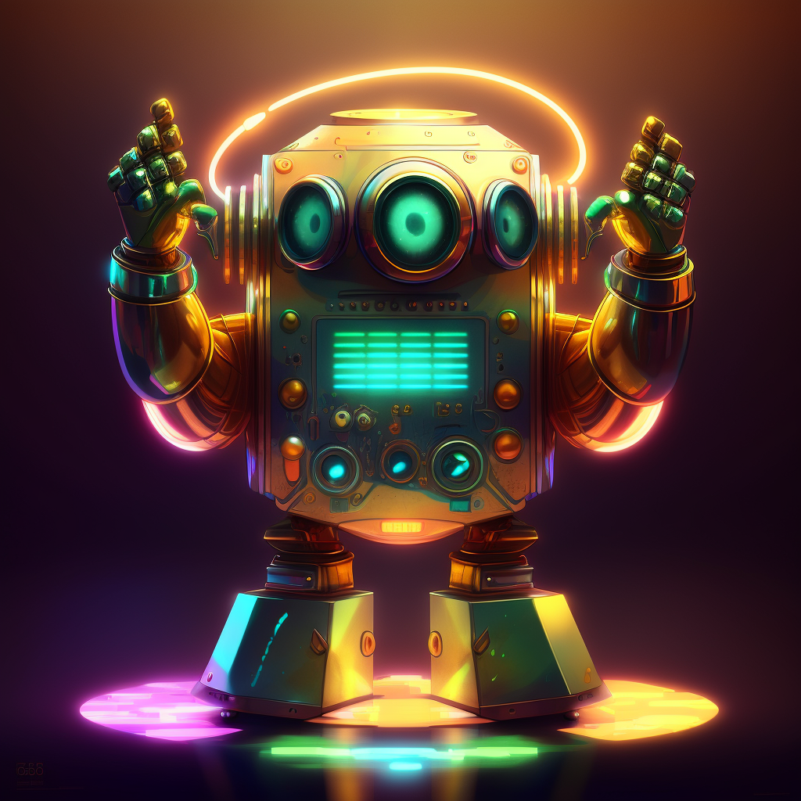

# ecv-discord-bot

<div style="text-align: center">
<br/>
<i>A disco(rd )bot image generated with this disco(rd )bot</i>
</div>

## Pré-recquis
- Node.js >= 18.0.0
- Npm >= 9.0.0
- Git LFS
- Un compte OpenAI (pour les fonctionnalitées qui en dépendent)

Quick start:
```sh
npm install && npm run clean && npm run build
npm start
```
Développement:
```sh
npm run clean && npm run watch & npm run dev
```

## Pensez à configurer le bot
Pour cela il suffit de créer un fichier `discobot.json` à la racine du dépôt, qui ne sera pas sauvegardé par git (Cf. `.gitignore`), en copiant `discobot.example.json`, et dans lequel vous pouvez mettre les clés privées de votre Bot.

## Fonctionnalitées prévues
Pour l'instant c'est un bot destiné à ne travailler que sur un serveur à la fois.
- [ ] Rendre le bot "multi-serveurs"
- [x] Réponds aux "hellos" que vous lui adressez par la commande `/hello`
- [x] Récupéres et/ou configures la clé d'API OpenAI confiée par un utilisateur via la commande `/openai-setup` (Chaque utilisateur peut se générer dans OpenAI une clé d'API dédiée et la fournir ici, ce qui lui permettra de suivre précisemment la consommation OpenAI de ce bot)
- [x] Listes les modèles OpenAI (ou "engines") actuellement proposé par l'API OpenAI
- [x] Complétes un texte via la commande `/openai-complete` (via OpenAI)
- [ ] Complétes un texte (DIY, sans service tiers et on-premise)
- [ ] Réponds à une conversation (OpenAI)
- [ ] Réponds à une conversation (DIY, sans service tiers et on-premise)
- [ ] Généres du code source (OpenAI)
- [ ] Généres du code source (DIY, sans service tiers et on-premise)
- [ ] Traduis un texte d'une langue vers une autre (OpenAI)
- [ ] Traduis un texte d'une langue vers une autre (DIY, sans service tiers et on-premise)
- [ ] Corrige un texte, son orthographe et sa grammaire (OpenAI)
- [ ] Evalues l'émotion d'un texte ou d'une phrase d'une conversation (OpenAI)
- [ ] Généres une image (OpenAI)
- [ ] Généres une image (DIY, sans service tiers et on-premise)
- [ ] ... *toutes les futures features imaginées à partir de la section ci-dessous*

Les futures fonctionnalitées "*DIY/On-premise*" risquent de nécessiter beaucoup de ressources en mémoire, processeur, espace disque et peut-être GPU. Si la machine hôte du bot ne fournie pas ces ressources, les fonctionnalitées pourraient ne pas fonctionner. Tout cela sera documenté succintement plus tard.

## Idées à explorer pouvant alimenter la roadmap
- Communiquer avec le bot par la voix
  - Lui demander des choses par la voix
  - Lui donner une voix et l'entendre répondre en audio
- Générer de la musique
- Voir le bot en vidéo
  - Animation 3D temps réel d'un avatar du bot
    - Animation d'une bouche (ou autre) dont les mouvements sont synchronisés avec sa voix
    - Expressions faciales
- Générer des modèles 3D utilisables dans
  - Three.js
  - Blender

# Documentation
La documentation technique peut être trouvée [ici](https://tongtwist.github.io/ecv-discord-bot/).
